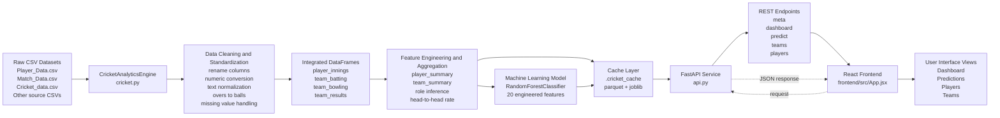

# Architecture Diagram: Cricket Analytics System

## Short Architecture Explanation
The project follows an end-to-end analytics architecture:

1. Raw cricket CSV files are loaded from multiple sources.
2. `CricketAnalyticsEngine` cleans and standardizes the data.
3. Aggregation and feature engineering create player and team summaries.
4. A Random Forest model is trained for match outcome prediction.
5. Processed data and trained artifacts are cached for faster startup.
6. FastAPI exposes analytics through REST endpoints.
7. React consumes the API and renders dashboard, teams, players, and predictions.

## Mermaid Diagram
Paste this into any Mermaid renderer, Markdown preview, or diagram tool that supports Mermaid.



## Animation-Friendly Block Version

Use these boxes in your slides or Canva animation:

```text
[Raw Cricket CSV Files]
        |
        v
[Data Cleaning + Standardization]
        |
        v
[Integrated DataFrames]
        |
        v
[Feature Engineering + Summaries]
        |
        +----> [Cache: parquet + joblib]
        |
        v
[Random Forest Match Prediction Model]
        |
        v
[FastAPI Backend]
        |
        v
[React Frontend Dashboard]
        |
        v
[User Prediction / Team / Player Insights]
```

## Best Labels to Use in the Diagram

Use these labels exactly in the visual:

- Raw Historical Cricket Data
- Data Cleaning and Standardization
- Unified Analytics Engine
- Player and Team Feature Engineering
- Match Prediction Model
- Performance Cache
- FastAPI Service Layer
- React Visualization Layer
- End User Analytics Interface

## Suggested Animation Plan

### Scene 1
Show raw files entering the system.

### Scene 2
Animate cleaning operations:

- rename columns
- convert numeric fields
- normalize names
- parse opponents
- create win/loss flags

### Scene 3
Animate 4 tables appearing:

- player innings
- team batting
- team bowling
- team results

### Scene 4
Animate feature cards appearing:

- batting average
- strike rate
- economy rate
- win rate
- head-to-head rate
- all-round impact

### Scene 5
Animate model training:

- encoded inputs
- feature matrix
- Random Forest
- probability output

### Scene 6
Animate cache branch:

- parquet files
- joblib model

### Scene 7
Animate API service calls:

- `/dashboard`
- `/predict`
- `/teams`
- `/players`

### Scene 8
Animate frontend pages:

- Dashboard
- Predictions
- Players
- Teams

## One-Line Architecture Summary for Speaking
This system transforms raw cricket datasets into machine learning predictions and interactive analytical insights through a Python analytics engine, cached model pipeline, FastAPI backend, and React frontend.
